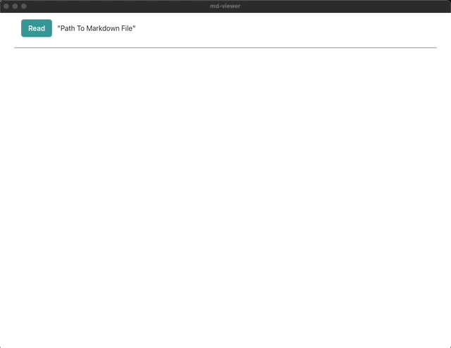
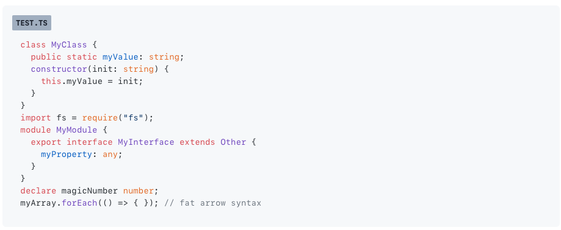
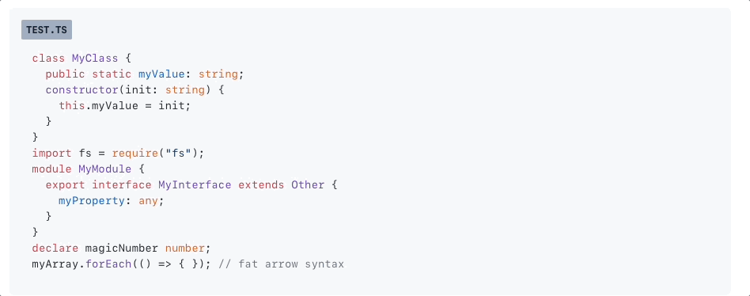

import CustomCode from "@components/CustomCode.astro";
export const components = {code: CustomCode}

# {frontmatter.title}

## 概要

Go言語とWebフロントエンドの技術を組み合わせてデスクトップアプリを開発できる[Wails](https://wails.io/)が気になっていたので、シンプルなマークダウンビューアーを作りました。

作成したアプリは下記のリポジトリで公開しています。
[https://github.com/yumu-uw/md-viewer](https://github.com/yumu-uw/md-viewer)

UIの実装にはReact、Vue、Svelteなどを使用可能で、今回はReactを採用しています。

## デモ


## 機能
機能としては単純にマークダウンを表示するものですが、最低限これは欲しいと思って実装した部分を紹介します。

### コードハイライト
マークダウン中にコードブロックがある場合、図のようにコードハイライトが適用されます。
「```typescript:test.ts」のように記載すると、言語とファイル名を判定してコードブロックに反映してくれます。


### コードコピー
コードブロックにマウスカーソルを載せるとコピーボタンが表示され、クリックするとコードをクリップボードにコピーします。


### ローカルにある画像の表示
UI部分がWebView上で動作するため、そのままだとローカルの画像が読み込めません。
そのため、バックエンドで動作しているGo側で画像をBase64エンコードし、フロント側にデータを渡すことでローカルの画像ファイル表示に対応しています。

## まとめ
Wailsが気になっていたことと、シンプルにマークダウンを見るだけのツールが意外と見つからなかったので今回自分で作成してみました。
今のところは1ファイルしか同時に開けませんが、タブ表示の実装やダークモードの対応も実施するつもりです。
